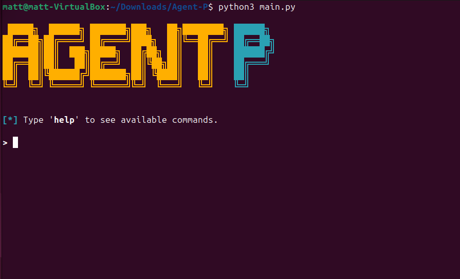
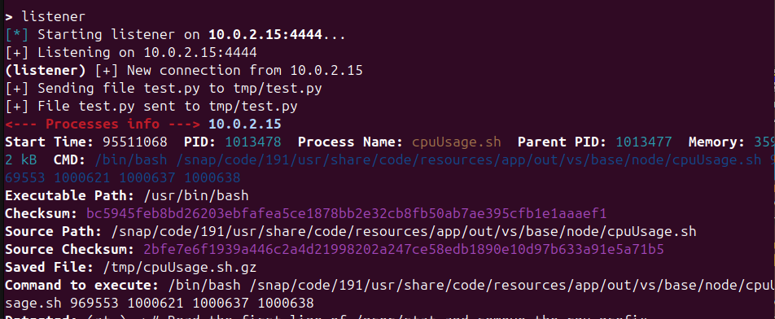
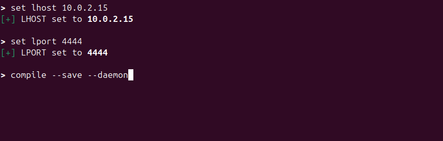

## Agent P
# Process Monitor
# Process Injector

A lightweight C-based tool for detecting and monitoring processes. I originally pivoted over three different times with this one project.

My original idea was to create a C-based program that would recursively go through the `/proc` directory and monitor new process creation. I then wanted to run checksums against the known processes on the system and return all other processes that were not in the list of checksums.

It did not turn out as planned—there were too many missed processes, and it was hard to track them all. I then turned to just monitoring for connections made on the host using the same logic of excluding a smaller list of known processes and logging everything else.

To my surprise, this worked. All you need to know is which processes create connections outside of the host. This was all done in C at first. However, I was limited to running it on a single machine, so I created a socket for the C-based component and routed everything through a proxy.

I then created the host in Python and also compiled the C component with various flags. Although this was originally meant to be a blue team tool, I pivoted once more. If I make this open source, I also need to consider what else it could be used for. So, I added optional flags that allow you to save the files the processes were created from, as well as an optional flag to hide itself and run in memory.

You’re also able to send files back to the host and run commands through the socket. The host sends a request and expects either a file or a command in response. However, you will have to wait until a process sends a request before you can send something back.

# Client Program

    - Connects to Proxy Server
    - Sends Request
    - Receives Mode from Proxy:
        If mode = 0x01 (Command Mode):
        Receive command
        Execute: command path

        If mode = 0x02 (File Mode):
        Receive file size and path
        Create directories if needed
        Save file to disk

## Features

- Tracks new processes.
- Monitors all network connections (TCP).
- Flags suspicious processes and their activity.
- Detects network connections even when no matching PID is found.
- Saves all files found from the source process.

## How It Works
This tool consists of two primary components:

### 1. **Process Tracker (`track.c`)**
- Checks the sum of current processes against a text file of known hashes.
- Monitors for any changes in processes.
- Monitors for new processes appearing in `/proc`.
- Matches against suspicious pattern lists or behavior.
- Invokes the connection finder when a suspicious PID is detected.

### 2. **Connection Finder (`finder.c`)**
- Inspects `/proc/[pid]/fd` to find open sockets for suspicious PIDs.
- Uses `netstat` to reverse-map network connections.

https://github.com/Matthew-a-smith/Agent

## Why Reverse Tracking and Process Injection?

Sometimes malicious processes exit quickly, hide their PIDs, or create socket connections before being tracked. It's often the low-hanging fruit—simple reverse shells that provide low-level access—where attackers get in. These are usually missed by most IDS tools, since they mimic legitimate processes.

This tool ensures no activity goes unnoticed, even if PID monitoring fails. Also, process injection can lead to persistence. If an attacker modifies a known, constantly running process, that effectively gives them long-term access to the system.

## Flags
 
| Flag                     | Purpose                                         |
|--------------------------|-------------------------------------------------|
| --set lhost <ip>         | Set the callback IP address                     |
| --set lport <port>       | Set the callback port                           |
| --show options           | Show current settings                           |
| --send <local> <remote>  | Send file from local path to remote address     |
| --run <cmd> <remote>     | Run commands on remote system                   |
| --compile                | Compile the agent with current settings         |
| --listener               | Start the listener server                       |
| exit                     | Exit the shell                                  |

| Compiler Flags | Description                                 |
|----------------|---------------------------------------------|
| --log          | Tracks all processes                        |
| --save         | Save source command if found to a file      |
| --daemon       | Run as a background process in memory       |

### Requirements
- Linux-based system
- GCC (for compilation)
- Root privileges (for full process/network access)
- Python for listener

Just set the listener address and compile with the flags you want. Depending on the compile-time flags, the listener behavior can change. Always set the listener after sending a command or file so it gets queued when a request is received to send back.

